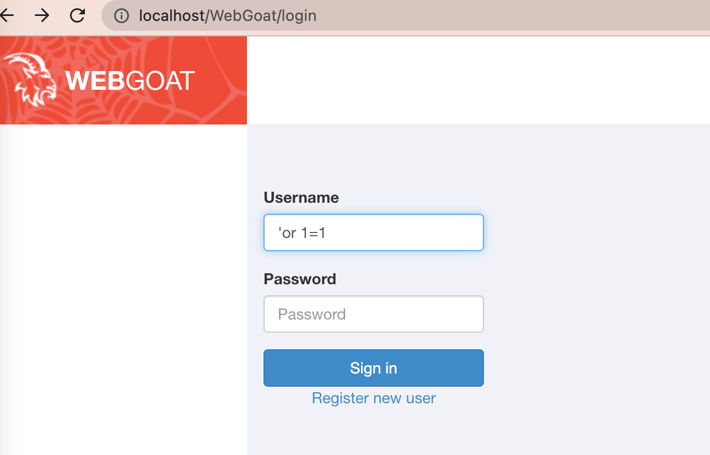
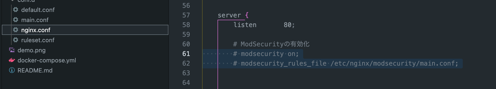
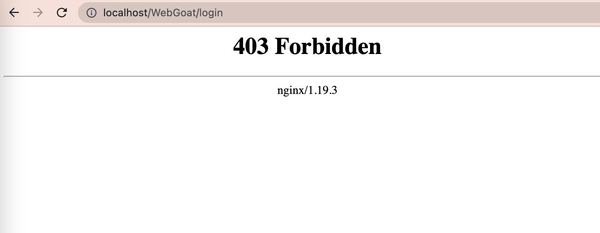

# play-modsecurity

## What is this?
It is for learning web security through modsecurity, which is a WAF tools.

This works with modsecurity and insecure app.

Therefore, you can try to protect against vulnerabilities by setting modsecurity rules.

## How To Set Up

### Run Containers
Type below command so that you can run container.

`docker compose up -d --build`

### Restart Nginx Server
After running containers, you need to restart nginx server(including modsecurity) so that it can integrate with WebGoat.

To enter and restart the nginx server, you type some commands.

Commands are as follows.

`docker exec -it modsec bash`

`/etc/init.d/nginx restart`

Then you can access the Webgoat via below URL. (please wait 30sec after typing above commands.)

`http://localhost/WebGoat`

## How To Change Rules

If you want to change modsecurity rule, you needs to update `./conf.d/ruleset.conf` .

Then, you will restart nginx server as I explained previously.

## How To Try Easy Test

After entering WebGoat, you type `'or 1=1` as sql injection like the below image.

In this ModSecurity may not recognize the attack.

Then, you will remove comment out and enable the below command in `./conf.d/main.conf`
`modsecurity on;`
`modsecurity_rules_file /etc/nginx/modsecurity/main.conf;`

After restarting nginx, when you retry `'or 1=1`, Modsecurity recognize and block the attack.

### Rreference
- [ModSecurity](https://github.com/SpiderLabs/ModSecurity)

- [WebGoat](https://github.com/WebGoat/WebGoat)

- [docker-nginx-modsecurity](https://github.com/Fufuhu/docker-nginx-modsecurity)

- [OSS WAF(Nginx + ModSecurity 3)のDockerイメージを作ったよ](https://note.com/ryoma_0923/n/ndff9c1a58743)

- [ModSecurity 3.0 and NGINX: Quick Start Guide](https://www.nginx.com/resources/library/modsecurity-3-nginx-quick-start-guide/)

- [OWASP ModSecurity Core Rule Set](https://owasp.org/www-project-modsecurity-core-rule-set/)

- [PRJ702: Protection of Web applications running on Docker against SQL injection attacks](https://antonblogwordpress.wordpress.com/2018/08/14/prj702-protection-of-web-applications-running-on-docker-against-sql-injection-attacks/)

- [オープンソースWAF「ModSecurity」で学ぶサーバーの防御](https://persol-tech-s.co.jp/corporate/security/article.html?id=2)

- [WebGoat: (Almost) Fully Documented Solution (en)](https://github.com/WebGoat/WebGoat/wiki/(Almost)-Fully-Documented-Solution-(en))

- [REQUEST-942-APPLICATION-ATTACK-SQLI.conf](https://github.com/SpiderLabs/owasp-modsecurity-crs/blob/v3.3/dev/rules/REQUEST-942-APPLICATION-ATTACK-SQLI.conf
)

